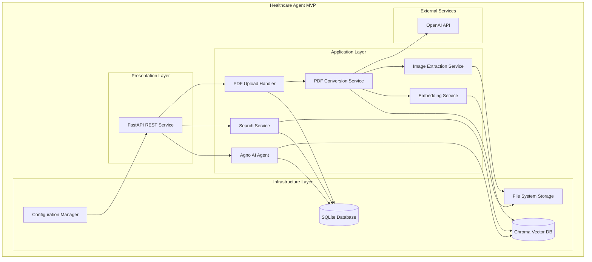
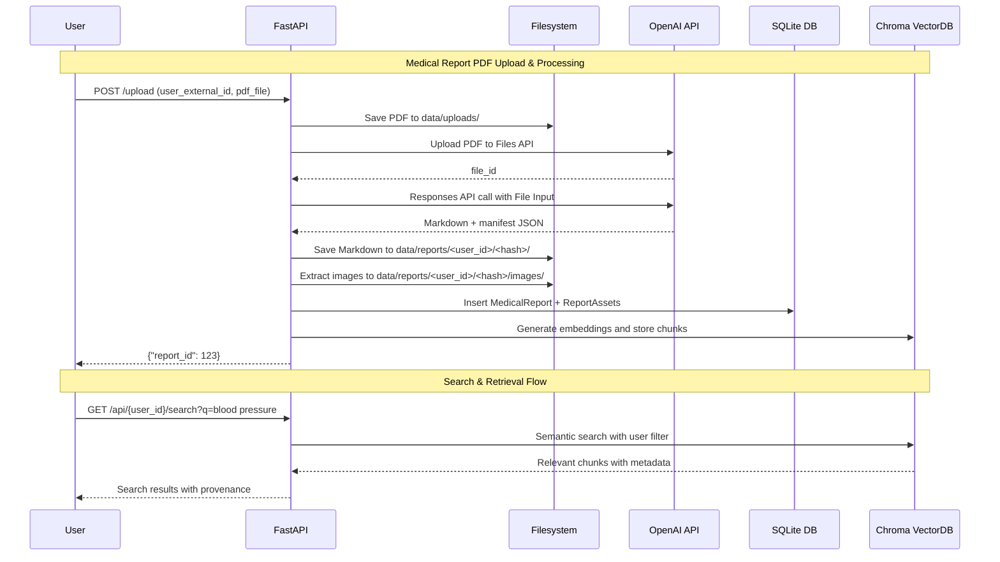
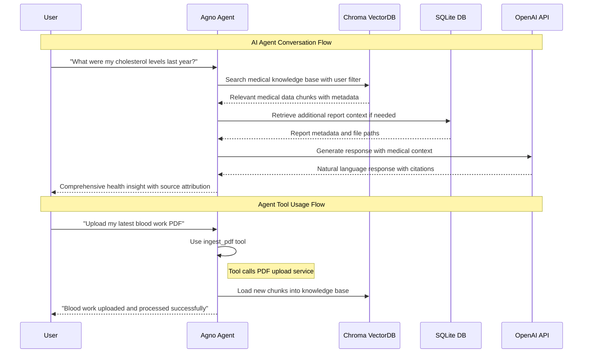

# Healthcare Agent MVP - Design Document

## Overview

The Healthcare Agent MVP is a personal health data management system that enables a single user to upload medical report PDFs, automatically convert them to structured Markdown format, store them in a local database, and query the longitudinal health data using natural language through an AI agent interface. The system leverages OpenAI's Responses API with File Inputs for document processing and the Agno framework for intelligent querying capabilities.

For setup and usage instructions, see the [Healthcare Agent README](../../agent/healthcare/README.md).

### Key Design Principles

1. **Privacy-First**: All data storage remains local with configurable external API usage
2. **Modular Architecture**: Separate concerns for maintainability and testing
3. **Extensible Design**: Built to accommodate future enhancements and scaling
4. **Error Resilience**: Comprehensive error handling with graceful degradation
5. **Test-Driven**: Unit tests integrated throughout the development process

## Architecture

### High-Level System Architecture



### Component Interaction Flow

#### PDF Upload & Processing Flow



#### Healthcare Agent Interaction Flow



## Dependency Injection and Service Management

### FastAPI Application State Pattern
The application uses FastAPI's `app.state` for service management with proper dependency injection:

```python
@asynccontextmanager
async def lifespan(app: FastAPI):
    """Application lifespan manager for startup and shutdown."""
    # Initialize services in dependency order
    config = ConfigManager.load_config()
    db_service = DatabaseService(config)
    embedding_service = EmbeddingService(config)
    search_service = SearchService(config, db_service, embedding_service)
    
    # Store services in app state for dependency injection
    app.state.config = config
    app.state.db_service = db_service
    app.state.embedding_service = embedding_service
    app.state.search_service = search_service
    
    yield
    
    # Cleanup on shutdown
    if db_service:
        db_service.close()
```

### Dependency Injection in Routes
Routes use FastAPI's `Depends()` system for clean service injection:

```python
def get_search_service(request: Request) -> SearchService:
    """Dependency function to get search service from app state."""
    if not hasattr(request.app.state, 'search_service'):
        raise HTTPException(status_code=503, detail="Search service not initialized")
    return request.app.state.search_service

@router.get("/search")
async def search_endpoint(
    query: str,
    search_service: SearchService = Depends(get_search_service)
) -> SearchResponse:
    """Search endpoint with injected service dependency."""
    return search_service.semantic_search(query)
```

### Benefits of This Pattern
- **Clean separation**: No global variables or manual service passing
- **Testable**: Easy to mock services in tests using `app.state`
- **Type-safe**: Full type checking and IDE support
- **FastAPI idiomatic**: Follows FastAPI best practices
- **Error handling**: Built-in service availability checking

## Components and Interfaces

### 1. Configuration and Deployment Component

**Location**: `agent/healthcare/config/`

**Responsibilities**:
- Environment configuration management
- Directory structure initialization
- Database schema creation
- API key validation
- Logging configuration

**Key Classes**:
```python
@dataclass
class Config:
    # API Configuration
    openai_api_key: str
    openai_model: str = "gpt-5"
    embedding_model: str = "text-embedding-3-large"
    
    # Storage Paths
    base_data_dir: Path = Path("data")
    uploads_dir: Path = Path("data/uploads")
    reports_dir: Path = Path("data/reports")
    chroma_dir: Path = Path("data/chroma")
    
    # Database Configuration
    medical_db_path: Path = Path("data/medical.db")
    agent_db_path: Path = Path("data/agent_sessions.db")
    
    # Processing Configuration
    chunk_size: int = 1000
    chunk_overlap: int = 200
    max_retries: int = 3
    request_timeout: int = 30

class ConfigManager:
    @staticmethod
    def load_config() -> Config
    
    @staticmethod
    def initialize_directories(config: Config) -> None
    
    @staticmethod
    def validate_environment(config: Config) -> None
```

### 2. PDF Upload Component

**Location**: `agent/healthcare/upload/`
**Main File**: `upload_service.py`

**Responsibilities**:
- PDF file validation and sanitization
- SHA-256 hash computation for deduplication
- File storage to structured directories
- Upload error handling and logging

**Key Classes**:
```python
class PDFUploadService:
    def __init__(self, config: Config, db_session: Session)
    
    def validate_pdf(self, file_content: bytes) -> bool
    
    def compute_hash(self, file_content: bytes) -> str
    
    def check_duplicate(self, user_id: int, file_hash: str) -> Optional[int]
    
    def store_pdf(self, file_content: bytes, filename: str, file_hash: str) -> Path
    
    async def upload_pdf(self, user_external_id: str, file: UploadFile) -> dict

# FastAPI Endpoints
@router.post("/upload")
async def upload_pdf(
    user_external_id: str = Form(...),
    file: UploadFile = File(...)
) -> JSONResponse
```

### 3. PDF Conversion Component

**Location**: `agent/healthcare/conversion/`
**Main File**: `conversion_service.py`

**Responsibilities**:
- OpenAI Files API integration
- PDF to Markdown conversion using Responses API
- Structured output parsing (Pydantic models)
- Conversion error handling and retries

**Key Classes**:
```python
@dataclass
class Figure:
    page: int
    index: int
    caption: Optional[str]
    filename: str

@dataclass 
class TableRef:
    page: int
    index: int
    title: Optional[str]
    format: str  # "markdown" | "tsv"

@dataclass
class ConversionResult:
    markdown: str
    manifest: dict  # {"figures": List[Figure], "tables": List[TableRef]}

class PDFConversionService:
    def __init__(self, config: Config, openai_client: OpenAI)
    
    def upload_to_openai(self, pdf_path: Path) -> str
    
    def convert_pdf_to_markdown(self, file_id: str) -> ConversionResult
    
    def save_markdown(self, markdown: str, report_dir: Path) -> Path
    
    @retry(max_attempts=3, backoff_type="exponential")
    async def process_pdf(self, pdf_path: Path, report_dir: Path) -> ConversionResult
```

### 4. Image Extraction Component

**Location**: `agent/healthcare/images/`

**Responsibilities**:
- Local PDF image extraction using pikepdf/pdfimages
- Page-indexed image naming and storage
- Image metadata collection and database storage
- Linking extracted images to Markdown placeholders

**Key Classes**:
```python
class ImageExtractionService:
    def __init__(self, config: Config)
    
    def extract_images_pikepdf(self, pdf_path: Path, output_dir: Path) -> List[Path]
    
    def extract_images_pdfimages(self, pdf_path: Path, output_dir: Path) -> List[Path]
    
    def generate_page_indexed_names(self, image_paths: List[Path]) -> Dict[Path, str]
    
    def link_to_manifest(self, extracted_images: List[Path], manifest: dict) -> List[AssetMetadata]
    
    def extract_and_process(self, pdf_path: Path, manifest: dict, images_dir: Path) -> List[AssetMetadata]

@dataclass
class AssetMetadata:
    kind: str  # "image" | "table"
    original_path: Path
    stored_path: Path
    alt_text: Optional[str]
    page_number: Optional[int]
```

### 5. Data Storage Component

**Location**: `agent/healthcare/storage/`

**Responsibilities**:
- SQLite database operations using SQLModel
- Vector database management with Chroma
- Embedding generation and storage
- Data integrity and relationship management

**Database Models**:
```python
class User(SQLModel, table=True):
    id: Optional[int] = Field(default=None, primary_key=True)
    external_id: str = Field(unique=True, index=True)
    created_at: datetime = Field(default_factory=datetime.utcnow)

class MedicalReport(SQLModel, table=True):
    id: Optional[int] = Field(default=None, primary_key=True)
    user_id: int = Field(foreign_key="user.id")
    filename: str
    file_hash: str = Field(index=True)
    language: Optional[str] = "en"
    markdown_path: str
    images_dir: Optional[str]
    meta_json: str  # JSON-encoded manifest
    created_at: datetime = Field(default_factory=datetime.utcnow)
    
    # Unique constraint on user_id + file_hash
    __table_args__ = (UniqueConstraint("user_id", "file_hash"),)

class ReportAsset(SQLModel, table=True):
    id: Optional[int] = Field(default=None, primary_key=True)
    report_id: int = Field(foreign_key="medicalreport.id")
    kind: str  # "image" | "table"
    path: str
    alt_text: Optional[str]

# Services
class DatabaseService:
    def __init__(self, config: Config)
    
    def create_tables(self) -> None
    
    def get_or_create_user(self, external_id: str) -> User
    
    def create_medical_report(self, user_id: int, report_data: dict) -> MedicalReport
    
    def create_report_assets(self, report_id: int, assets: List[AssetMetadata]) -> None

class EmbeddingService:
    def __init__(self, config: Config, chroma_client: chromadb.Client)
    
    def chunk_markdown(self, markdown: str) -> List[str]
    
    def generate_embeddings(self, chunks: List[str]) -> List[List[float]]
    
    def store_chunks(self, chunks: List[str], embeddings: List[List[float]], metadata: dict) -> None
    
    @retry(max_attempts=3)
    def process_report_embeddings(self, markdown_content: str, report_metadata: dict) -> None
```

### 6. Search and Retrieval Component

**Location**: `agent/healthcare/search/`

**Responsibilities**:
- Semantic search using Chroma vector database
- User-scoped data retrieval
- Search result ranking and metadata enrichment
- Query validation and input sanitization with automatic whitespace stripping

**Key Classes**:
```python
@dataclass
class SearchResult:
    content: str
    relevance_score: float
    report_id: int
    chunk_index: int
    filename: str
    created_at: datetime

class SearchService:
    def __init__(self, config: Config, chroma_client: chromadb.Client, db_session: Session)
    
    def validate_query(self, query: str) -> bool
    
    def semantic_search(self, user_external_id: str, query: str, k: int = 5) -> List[SearchResult]
        # Automatically strips whitespace from user_external_id and query parameters
    
    def get_search_stats(self, user_external_id: str) -> Dict[str, Any]
        # Automatically strips whitespace from user_external_id parameter
    
    def enrich_with_metadata(self, raw_results: List, user_id: int) -> List[SearchResult]

# FastAPI Endpoints  
@router.get("/api/{user_external_id}/search")
async def search_reports(
    user_external_id: str,
    q: str = Query(..., min_length=1),
    k: int = Query(5, ge=1, le=20)
) -> JSONResponse
```

### 7. Report Management Component

**Location**: `agent/healthcare/reports/`

**Responsibilities**:
- Report listing and metadata retrieval
- Markdown content serving
- Asset file management
- User access control validation

**Key Classes**:
```python
class ReportService:
    def __init__(self, config: Config, db_session: Session)
    
    def list_user_reports(self, user_external_id: str) -> List[dict]
    
    def get_report_markdown(self, report_id: int, user_external_id: str) -> str
    
    def list_report_assets(self, report_id: int, user_external_id: str) -> List[dict]
    
    def validate_user_access(self, report_id: int, user_external_id: str) -> bool

# FastAPI Endpoints
@router.get("/reports/{user_external_id}")
async def list_reports(user_external_id: str) -> JSONResponse

@router.get("/reports/{report_id}/markdown") 
async def get_report_markdown(report_id: int, user_external_id: str = Query(...)) -> JSONResponse

@router.get("/reports/{report_id}/assets")
async def list_report_assets(report_id: int, user_external_id: str = Query(...)) -> JSONResponse
```

### 8. AI Agent Integration Component

**Location**: `agent/healthcare/agent/`

**Responsibilities**:
- Agno agent configuration and initialization
- Custom medical toolkit implementation
- Conversation history management
- Agent error handling and response formatting

**Key Classes**:
```python
class MedicalToolkit(Toolkit):
    def __init__(self, knowledge_base: AgentKnowledge, db_session: Session)
    
    @tool(name="ingest_pdf")
    def ingest_pdf(self, user_external_id: str, pdf_path: str) -> str
    
    @tool(name="list_reports") 
    def list_reports(self, user_external_id: str) -> List[str]
    
    @tool(name="search_medical_data")
    def search_medical_data(self, user_external_id: str, query: str, k: int = 5) -> List[dict]

class HealthcareAgent:
    def __init__(self, config: Config)
    
    def initialize_agent(self) -> Agent
    
    def load_knowledge_base(self) -> None
    
    def process_query(self, user_external_id: str, query: str) -> str
    
    def get_conversation_history(self, user_external_id: str) -> List[dict]

# Agent Configuration
def create_healthcare_agent(config: Config) -> Agent:
    knowledge = AgentKnowledge(
        vector_db=ChromaDb(
            collection="medical_reports",
            path=str(config.chroma_dir),
            persistent_client=True
        ),
        embedder=OpenAIEmbedder(
            model=config.embedding_model,
            dimensions=3072
        ),
    )
    
    agent = Agent(
        name="Healthcare Assistant",
        model=OpenAIChat(id=config.openai_model),
        storage=SqliteStorage(
            table_name="agent_sessions",
            db_file=str(config.agent_db_path)
        ),
        knowledge=knowledge,
        tools=[MedicalToolkit(knowledge, db_session)],
        instructions=[
            "You are a healthcare AI assistant specialized in analyzing medical reports.",
            "Always search your knowledge base before answering questions about medical data.",
            "Provide clear, accurate information with proper source attribution.",
            "If you don't have enough information, ask clarifying questions.",
            "Maintain patient privacy and never share data across different users."
        ],
        add_history_to_messages=True,
        num_history_runs=5,
        markdown=True,
    )
    
    return agent
```

## System Health and Monitoring

### Comprehensive Health Check Implementation

The system implements a comprehensive health check endpoint that monitors all services stored in `app.state` and provides detailed status information for system administrators.

**Location**: `agent/healthcare/main.py`
**Endpoint**: `GET /health`

**Key Features**:
- **Service-Level Health Checks**: Individual status monitoring for all application services
- **Connectivity Testing**: Active database and vector database connection verification
- **Configuration Validation**: Service configuration and dependency verification
- **Structured Response Format**: Consistent JSON response with detailed service information
- **Status Classification**: Three-tier status system (healthy, degraded, unhealthy)
- **Error Handling**: Graceful error handling with detailed error reporting

### Health Check Implementation

```python
@app.get("/health")
async def health_check():
    """Health check endpoint for all services."""
    from datetime import datetime
    from sqlmodel import text
    
    health_status = {
        "status": "healthy",
        "timestamp": datetime.utcnow().isoformat(),
        "version": "0.1.0",
        "services": {}
    }
    
    # Check configuration service
    if hasattr(app.state, 'config') and app.state.config:
        health_status["services"]["config"] = {
            "status": "healthy",
            "openai_model": app.state.config.openai_model,
            "embedding_model": app.state.config.embedding_model,
            "base_data_dir_exists": app.state.config.base_data_dir.exists()
        }
    else:
        health_status["services"]["config"] = {"status": "not_initialized"}
        health_status["status"] = "degraded"

    # Check database service with active connectivity test
    if hasattr(app.state, 'db_service') and app.state.db_service:
        try:
            with app.state.db_service.get_session() as session:
                session.exec(text("SELECT 1")).first()
            health_status["services"]["database"] = {
                "status": "healthy", 
                "connection": "active"
            }
        except Exception as e:
            health_status["services"]["database"] = {
                "status": "unhealthy", 
                "error": str(e)
            }
            health_status["status"] = "unhealthy"
    else:
        health_status["services"]["database"] = {"status": "not_initialized"}
        health_status["status"] = "degraded"

    # Check embedding service
    if hasattr(app.state, 'embedding_service') and app.state.embedding_service:
        try:
            embedding_config = app.state.embedding_service.config
            health_status["services"]["embedding"] = {
                "status": "healthy",
                "model": embedding_config.embedding_model,
                "chunk_size": embedding_config.chunk_size,
                "chunk_overlap": embedding_config.chunk_overlap
            }
        except Exception as e:
            health_status["services"]["embedding"] = {
                "status": "unhealthy", 
                "error": str(e)
            }
            health_status["status"] = "unhealthy"
    else:
        health_status["services"]["embedding"] = {"status": "not_initialized"}
        health_status["status"] = "degraded"

    # Check search service
    if hasattr(app.state, 'search_service') and app.state.search_service:
        try:
            search_config = app.state.search_service.config
            health_status["services"]["search"] = {
                "status": "healthy",
                "embedding_model": search_config.embedding_model,
                "vector_db": "chroma"
            }
        except Exception as e:
            health_status["services"]["search"] = {
                "status": "unhealthy", 
                "error": str(e)
            }
            health_status["status"] = "unhealthy"
    else:
        health_status["services"]["search"] = {"status": "not_initialized"}
        health_status["status"] = "degraded"

    # Return appropriate HTTP status code based on overall health
    if health_status["status"] == "unhealthy":
        raise HTTPException(status_code=503, detail=health_status)
    elif health_status["status"] == "degraded":
        raise HTTPException(status_code=503, detail=health_status)
    
    return health_status
```

### Health Status Response Format

**Healthy System Response (HTTP 200)**:
```json
{
  "status": "healthy",
  "timestamp": "2024-01-15T10:30:00.123456Z",
  "version": "0.1.0",
  "services": {
    "config": {
      "status": "healthy",
      "openai_model": "gpt-4o-mini",
      "embedding_model": "text-embedding-3-large",
      "base_data_dir_exists": true
    },
    "database": {
      "status": "healthy",
      "connection": "active"
    },
    "embedding": {
      "status": "healthy",
      "model": "text-embedding-3-large",
      "chunk_size": 1000,
      "chunk_overlap": 200
    },
    "search": {
      "status": "healthy",
      "embedding_model": "text-embedding-3-large",
      "vector_db": "chroma"
    }
  }
}
```

**Degraded System Response (HTTP 503)**:
```json
{
  "status": "degraded",
  "timestamp": "2024-01-15T10:30:00.123456Z",
  "version": "0.1.0",
  "services": {
    "config": {
      "status": "healthy",
      "openai_model": "gpt-4o-mini",
      "embedding_model": "text-embedding-3-large",
      "base_data_dir_exists": true
    },
    "database": {
      "status": "not_initialized"
    },
    "embedding": {
      "status": "not_initialized"
    },
    "search": {
      "status": "not_initialized"
    }
  }
}
```

**Unhealthy System Response (HTTP 503)**:
```json
{
  "status": "unhealthy",
  "timestamp": "2024-01-15T10:30:00.123456Z",
  "version": "0.1.0",
  "services": {
    "config": {
      "status": "healthy",
      "openai_model": "gpt-4o-mini",
      "embedding_model": "text-embedding-3-large",
      "base_data_dir_exists": true
    },
    "database": {
      "status": "unhealthy",
      "error": "Connection refused: unable to connect to database"
    },
    "embedding": {
      "status": "healthy",
      "model": "text-embedding-3-large",
      "chunk_size": 1000,
      "chunk_overlap": 200
    },
    "search": {
      "status": "healthy",
      "embedding_model": "text-embedding-3-large",
      "vector_db": "chroma"
    }
  }
}
```

### Status Classification

1. **Healthy (HTTP 200)**: All services are initialized and functioning properly
2. **Degraded (HTTP 503)**: Some services are not initialized but no active failures
3. **Unhealthy (HTTP 503)**: One or more services have active failures or connection issues

### Benefits of Enhanced Health Check

- **Comprehensive Monitoring**: Visibility into all critical system components
- **Proactive Issue Detection**: Early warning system for service degradation
- **Debugging Support**: Detailed error information for troubleshooting
- **Operational Excellence**: Standard monitoring interface for deployment automation
- **Service Dependencies**: Clear understanding of service initialization status
- **Configuration Validation**: Verification of critical configuration parameters

## Data Models

### SQLite Database Schema

```sql
-- Users table for external ID mapping
CREATE TABLE users (
    id INTEGER PRIMARY KEY AUTOINCREMENT,
    external_id TEXT NOT NULL UNIQUE,
    created_at DATETIME DEFAULT CURRENT_TIMESTAMP
);

-- Medical reports metadata
CREATE TABLE medical_reports (
    id INTEGER PRIMARY KEY AUTOINCREMENT,
    user_id INTEGER NOT NULL REFERENCES users(id) ON DELETE CASCADE,
    filename TEXT NOT NULL,
    file_hash TEXT NOT NULL,
    language TEXT DEFAULT 'en',
    markdown_path TEXT NOT NULL,
    images_dir TEXT,
    meta_json TEXT NOT NULL,
    created_at DATETIME DEFAULT CURRENT_TIMESTAMP,
    UNIQUE(user_id, file_hash)
);

-- Report assets (images, tables, etc.)
CREATE TABLE report_assets (
    id INTEGER PRIMARY KEY AUTOINCREMENT,
    report_id INTEGER NOT NULL REFERENCES medical_reports(id) ON DELETE CASCADE,
    kind TEXT NOT NULL CHECK (kind IN ('image', 'table')),
    path TEXT NOT NULL,
    alt_text TEXT,
    page_number INTEGER,
    created_at DATETIME DEFAULT CURRENT_TIMESTAMP
);

-- Indexes for performance
CREATE INDEX idx_users_external_id ON users(external_id);
CREATE INDEX idx_reports_user_id ON medical_reports(user_id);
CREATE INDEX idx_reports_hash ON medical_reports(file_hash);
CREATE INDEX idx_assets_report_id ON report_assets(report_id);
```

### Vector Database Schema (Chroma)

```python
# Collection: medical_reports
# Metadata Schema:
{
    "user_external_id": str,       # User identifier for access control
    "user_id": int,                # Internal user ID
    "report_id": int,              # Medical report ID
    "chunk_index": int,            # Chunk position in document
    "filename": str,               # Original PDF filename
    "created_at": str,             # ISO timestamp
    "content_type": str,           # "paragraph" | "table" | "list"
    "page_number": Optional[int],   # Source page if available
    "section_title": Optional[str] # Document section if detected
}
```

### API Response Models

```python
# Pydantic models for API responses
class ReportSummary(BaseModel):
    id: int
    filename: str
    created_at: datetime
    
class ReportListResponse(BaseModel):
    reports: List[ReportSummary]
    total: int

class SearchResult(BaseModel):
    content: str
    relevance_score: float
    report_id: int
    chunk_index: int
    filename: str
    created_at: datetime

class SearchResponse(BaseModel):
    results: List[SearchResult]
    query: str
    total_results: int
    
class AssetInfo(BaseModel):
    id: int
    kind: str
    filename: str
    alt_text: Optional[str]
    page_number: Optional[int]

class ErrorResponse(BaseModel):
    error: str
    message: str
    details: Optional[dict] = None
```

## Error Handling

### Error Classification and Handling Strategy

1. **Input Validation Errors**
   - Invalid PDF format: Return 400 with clear message
   - Missing required fields: Return 422 with field-specific errors
   - File size exceeds limit: Return 413 with size information

2. **External Service Errors**
   - OpenAI API failures: Implement exponential backoff retry (3 attempts)
   - Network timeouts: Return 503 with retry-after header
   - Rate limiting: Queue requests with circuit breaker pattern

3. **Storage Errors**
   - Database connection failures: Return 500 with generic message, log details
   - Disk space issues: Return 507 with storage cleanup recommendations
   - File permission errors: Return 500, log specific permissions needed

4. **Processing Errors**
   - PDF corruption: Return 422 with file repair suggestions
   - Image extraction failures: Continue without images, log warnings

### Error Response Format

```python
class ErrorHandler:
    @staticmethod
    def format_error_response(error_type: str, message: str, details: dict = None) -> JSONResponse:
        return JSONResponse(
            status_code=ERROR_STATUS_CODES[error_type],
            content={
                "error": error_type,
                "message": message,
                "details": details,
                "timestamp": datetime.utcnow().isoformat()
            }
        )

# Global exception handler for FastAPI
@app.exception_handler(Exception)
async def global_exception_handler(request: Request, exc: Exception):
    logger.error(f"Unhandled exception: {exc}", exc_info=True)
    return ErrorHandler.format_error_response(
        "internal_server_error",
        "An unexpected error occurred"
    )
```

### Retry Logic Implementation

```python
from tenacity import retry, stop_after_attempt, wait_exponential, retry_if_exception_type

class RetryableService:
    @retry(
        stop=stop_after_attempt(3),
        wait=wait_exponential(multiplier=1, min=2, max=10),
        retry=retry_if_exception_type((requests.RequestException, openai.APIError))
    )
    async def call_openai_api(self, **kwargs):
        # OpenAI API call implementation
        pass
    
    @retry(
        stop=stop_after_attempt(2),
        wait=wait_exponential(multiplier=0.5, min=1, max=5)
    )
    def extract_images(self, pdf_path: Path):
        # Image extraction with retry
        pass
```

## Testing Strategy

### Test Structure and Organization

```
tests/
├── agent/
│   └── healthcare/
│       ├── test_config.py
│       ├── test_upload.py
│       ├── test_conversion.py
│       ├── test_images.py
│       ├── test_storage.py
│       ├── test_search.py
│       ├── test_reports.py
│       ├── test_agent.py
│       ├── test_integration_api_endpoints.py
│       ├── test_integration_full_workflow.py
│       ├── test_integration_database_operations.py
│       └── fixtures/
│           ├── sample_medical_reports/
│           ├── mock_responses/
│           └── test_data.json
└── conftest.py
```

### Testing Approach

1. **Unit Tests (90%+ coverage target)**
   ```python
   # Example unit test structure
   class TestPDFUploadService:
       def setup_method(self):
           self.config = Config(base_data_dir=Path("test_data"))
           self.service = PDFUploadService(self.config, mock_db_session)
       
       def test_validate_pdf_valid_file(self):
           with open("fixtures/sample.pdf", "rb") as f:
               assert self.service.validate_pdf(f.read()) is True
       
       def test_validate_pdf_invalid_file(self):
           fake_pdf = b"Not a PDF"
           assert self.service.validate_pdf(fake_pdf) is False
       
       def test_compute_hash_consistency(self):
           content = b"test content"
           hash1 = self.service.compute_hash(content)
           hash2 = self.service.compute_hash(content)
           assert hash1 == hash2
           assert len(hash1) == 64  # SHA-256 length
   ```

2. **Integration Tests**
   ```python
   # tests/agent/healthcare/test_integration_full_workflow.py
   @pytest.mark.integration
   class TestIntegrationFullWorkflow:
       async def test_complete_pdf_ingestion_flow(self, test_client, sample_pdf):
           # Test complete flow from upload to search
           response = await test_client.post("/upload", 
               data={"user_external_id": "test_user"},
               files={"file": sample_pdf}
           )
           assert response.status_code == 200
           report_id = response.json()["report_id"]
           
           # Verify markdown was created
           markdown_response = await test_client.get(f"/reports/{report_id}/markdown")
           assert markdown_response.status_code == 200
           
           # Verify search works
           search_response = await test_client.get("/api/test_user/search?q=diagnosis")
           assert search_response.status_code == 200
           assert len(search_response.json()["results"]) > 0
   ```

3. **Mock External Services**
   ```python
   # tests/conftest.py - Global fixtures
   @pytest.fixture
   def mock_openai_client():
       with patch('openai.OpenAI') as mock:
           mock_instance = mock.return_value
           mock_instance.files.create.return_value.id = "file-123"
           mock_instance.responses.parse.return_value.output_parsed = ConversionResult(
               markdown="# Test Report\n\nSample content",
               manifest={"figures": [], "tables": []}
           )
           yield mock_instance
   ```

## Design Decisions and Rationales

### 1. Technology Stack Choices

**FastAPI over Flask/Django**:
- Automatic API documentation with OpenAPI/Swagger
- Native async support for OpenAI API calls
- Built-in request validation with Pydantic
- Better performance for I/O bound operations

**SQLModel over pure SQLAlchemy**:
- Type safety with Pydantic integration
- Simplified model definitions
- Better IDE support and error catching
- Easier testing with type hints

**Chroma over Pinecone/Weaviate**:
- Local deployment requirement (no external dependencies)
- Simple setup and configuration
- Good performance for small to medium datasets
- Native Python integration

### 2. Architecture Patterns

**Layered Architecture**:
- Clear separation of concerns
- Easier testing and mocking
- Better maintainability and evolution
- Simplified debugging and logging

**Dependency Injection**:
- Loose coupling between components
- Easier unit testing with mocks
- Configuration flexibility
- Better error isolation

**Repository Pattern for Data Access**:
- Abstraction over database operations
- Simplified testing with mock repositories
- Easier database migration if needed
- Consistent data access patterns

### 3. Error Handling Strategy

**Fail-Fast with Graceful Degradation**:
- Quick validation and early error detection
- Partial functionality when possible (e.g., continue without images)
- Clear error messages for debugging
- Comprehensive logging for troubleshooting

### 4. Security Considerations

**Input Validation and Sanitization**:
- PDF file format validation
- Path traversal prevention
- SQL injection protection via parameterized queries
- XSS prevention in API responses

**Data Privacy**:
- Local storage by default
- Configurable external API usage
- User data isolation in vector database
- Minimal logging of sensitive information

This design provides a solid foundation for the Healthcare Agent MVP, ensuring scalability, maintainability, and robust error handling while meeting all specified requirements.
