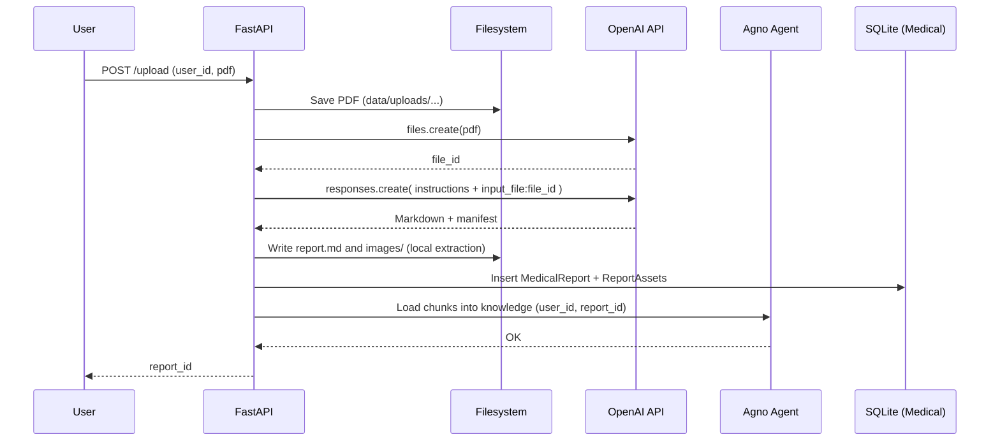

# Healthcare Agent – Functional Requirements & Design&#x20;

> **Objective**: Build an AI agent (Agno) that ingests medical reports in **PDF**, converts them to **Markdown** (including tables + image handling), stores canonical artifacts in **SQLite**, supports **multiple reports per user**, and enables retrieval + RAG-backed Q&A across a user’s longitudinal health data. **Docling is replaced by OpenAI’s Responses API with File Inputs** for the PDF→Markdown conversion step.

## 1) Context & Goals

- **Users**: Patients (or care teams) uploading their own medical reports.
- **Input**: PDF medical report (scanned or digital-native). Some contain complex layouts, tables, and embedded images.
- **Output**: Canonical **Markdown** representation, plus extracted **assets** (images) and optional **structured fields** (diagnoses, lab values, etc.).
- **Persistence**: SQLite database for metadata + file paths; file system for Markdown and assets.
- **Retrieval**: Text search + semantic search (RAG) over Markdown chunks, with provenance to exact report and section.
- **Privacy**: Handle PHI; keep storage local by default; minimize model exposure.

## 2) Functional Requirements

1. **Upload & Ingest**

   - Accept PDF upload via API/UI.
   - Compute SHA-256 hash for deduplication per user.
   - Store original PDF to `data/uploads/`.

2. **PDF → Markdown (using OpenAI File Inputs)**

   - Upload PDF to OpenAI **Files API** and reference `file_id` in the **Responses API** request.
   - Prompt the model to **produce high-fidelity Markdown**, preserving:
     - Headings hierarchy
     - Paragraphs and lists
     - **Tables** as Markdown tables (or a fenced block fallback for wide tables)
     - **Figure placeholders** with captions and page anchors (e.g., ``)
   - Also request a **manifest** describing detected tables and figures with page numbers (for downstream linkage).

3. **Images**

   - Extract embedded images **locally** (recommended) for PHI control and pixel accuracy.
     - Save to `data/reports/user_{id}/{reportHash}/images/`.
     - Link extracted files to Markdown image placeholders created by the model, using page-based naming.
   - If image extraction fails or is not permitted, keep **figure captions** (text-only) with page anchors.

4. **Storage**

   - Save canonical Markdown to disk; record path and metadata in **SQLite**.
   - Record assets (images) with type + path + optional alt text/caption.
   - Support **multiple reports per user** (one-to-many).

5. **Retrieval & Search**

   - List, view, and download reports per user.
   - RAG: chunk Markdown and store embeddings in a local vector DB (e.g., Chroma). Include `user_id` and `report_id` metadata.
   - Semantic search returns snippets with provenance, restricted to the requesting user.

6. **Optional Structured Extraction**

   - From Markdown, use **Structured Outputs** to extract JSON fields (e.g., diagnoses, lab panels). Persist separately for analytics.

7. **Security & Compliance**

   - Local storage; configurable policy to disable uploading highly sensitive documents to external APIs.
   - Redact PII in logs, signed URLs, and telemetry.
   - (Optional) Encrypt at rest (SQLite w/ OS disk encryption or use SQLCipher). Access controls on API.

## 3) Non‑Functional Requirements

- **Accuracy**: Markdown must be faithful; tables should maintain headers, units, and alignment where possible.
- **Resilience**: Handle malformed PDFs and OCR-like scans.
- **Scalability**: Support hundreds of reports per user; nightly maintenance tasks for vector DB.
- **Cost control**: Batch long PDFs (page-ranged processing) and cap token usage; configurable model and temperature.
- **Observability**: Structured logs w/ ingest IDs; traces around file upload, model calls, storage.

## 4) System Architecture

**Components**

- **FastAPI service** (upload, list, fetch, search, extract)
- **Agno Agent**
  - **Model**: OpenAI (e.g., `gpt-5-mini`) for conversion and reasoning
  - **Tools**: Ingest/list/get/search custom tools
  - **Knowledge**: Vector DB (Chroma) populated with Markdown chunks
  - **Storage**: Agno session storage (SQLite) (separate from medical DB)
- **Medical DB (SQLite)**: Users, MedicalReports, ReportAssets, (optional) ReportFields
- **Filesystem**: PDFs, Markdown, images

**Ingestion Sequence (Mermaid)**



## 5) Data Model (SQLite)

**Tables**

```sql
CREATE TABLE users (
  id INTEGER PRIMARY KEY,
  external_id TEXT NOT NULL UNIQUE
);

CREATE TABLE medical_reports (
  id INTEGER PRIMARY KEY,
  user_id INTEGER NOT NULL REFERENCES users(id),
  filename TEXT NOT NULL,
  file_hash TEXT NOT NULL,
  language TEXT,
  markdown_path TEXT NOT NULL,
  images_dir TEXT,
  meta_json TEXT,
  created_at DATETIME DEFAULT CURRENT_TIMESTAMP,
  UNIQUE(user_id, file_hash)
);

CREATE TABLE report_assets (
  id INTEGER PRIMARY KEY,
  report_id INTEGER NOT NULL REFERENCES medical_reports(id),
  kind TEXT NOT NULL,           -- 'image' | 'table'
  path TEXT NOT NULL,
  alt_text TEXT
);

CREATE TABLE report_fields (
  id INTEGER PRIMARY KEY,
  report_id INTEGER NOT NULL REFERENCES medical_reports(id),
  key TEXT NOT NULL,
  value_json TEXT NOT NULL
);
```

## 6) API Design (FastAPI)

- `POST /upload` — multipart form (`user_external_id`, `file`) → returns `report_id`
- `GET /reports/{user_external_id}` — list reports
- `GET /reports/{report_id}/markdown` — get Markdown
- `GET /reports/{user_external_id}/search?q=...&k=5` — semantic search
- `GET /reports/{report_id}/assets` — list asset files

**Request/Response Examples**

`POST /upload`

```http
200 OK
{
  "report_id": 123
}
```

`GET /reports/kevin.lin`

```json
{
  "reports": [
    {"id":123, "filename":"CT_Scan_2025-03-20.pdf"},
    {"id":130, "filename":"Bloodwork_2025-06-01.pdf"}
  ]
}
```

## 7) Agno Agent & Tools

**Agent**

```python
from agno.agent import Agent, AgentKnowledge
from agno.models.openai import OpenAIChat
from agno.storage.sqlite import SqliteStorage
from agno.vectordb.chroma import ChromaDb
from agno.embedder.openai import OpenAIEmbedder

agent = Agent(
    model=OpenAIChat(id="gpt-5-mini"),
    storage=SqliteStorage(table_name="agent_sessions", db_file="data/agent_sessions.db"),
    knowledge=AgentKnowledge(
        vector_db=ChromaDb(collection="medical_reports", path="data/chroma", persistent_client=True),
        embedder=OpenAIEmbedder(),
    ),
    add_history_to_messages=True,
    markdown=True,
)
```

**Toolkit (Tools)**

```python
from agno.tools import Toolkit, tool
from sqlmodel import select
from pathlib import Path
from db import get_session, User, MedicalReport, ReportAsset
from ingest import ingest_report  # defined below

class MedicalToolkit(Toolkit):
    def __init__(self, kb):
        super().__init__()
        self.kb = kb

    @tool(name="ingest_pdf")
    def ingest_pdf(self, user_external_id: str, pdf_path: str) -> str:
        report_id = ingest_report(user_external_id, pdf_path)
        with get_session() as s:
            mr = s.get(MedicalReport, report_id)
            md = Path(mr.markdown_path).read_text(encoding="utf-8")
            chunks = [c.strip() for c in md.split("\n\n") if c.strip()]
            for i, ch in enumerate(chunks):
                self.kb.load_text(ch, metadata={
                    "user_external_id": user_external_id,
                    "report_id": report_id,
                    "chunk_index": i,
                })
        return f"report_id={report_id}"

    @tool(name="list_reports")
    def list_reports(self, user_external_id: str) -> list[str]:
        with get_session() as s:
            user = s.exec(select(User).where(User.external_id == user_external_id)).first()
            if not user: return []
            rows = s.exec(select(MedicalReport).where(MedicalReport.user_id == user.id)).all()
            return [f"{r.id} :: {r.filename}" for r in rows]
```

## 8) Ingest Pipeline (OpenAI File Inputs)

**High-Level Steps**

1. Save uploaded PDF locally and compute `sha256`.
2. Upload the file to OpenAI **Files API** → receive `file_id`.
3. Call **Responses API** with **File Input**:
   - Provide conversion **instructions**.
   - Include the `file_id` as an **input\_file**.
   - Request **two outputs**:
     1. a Markdown string; 2) a **manifest** JSON listing tables/figures with page indices and suggested filenames.
4. Persist the returned Markdown to `report.md`.
5. **Image extraction** (local): extract embedded images from the PDF into `images/` (page-indexed). If permissible, also generate alt text using the model.
6. Insert `medical_reports` + `report_assets`. Register images and (optional) table CSVs.
7. Chunk the Markdown → embed → upsert to vector DB with metadata.

**Conversion Prompt (Template)**

```text
You are a document conversion engine. Given the attached PDF, output:
1) A faithful Markdown conversion preserving hierarchy, lists, page anchors, and tables.
   - Use ATX headings (#, ##, ###) reflecting the original structure.
   - Convert tables to Markdown tables. For very wide tables, use a fenced block with TSV inside.
   - When you encounter images/figures, insert placeholders using this format:
     
     Also include a figure caption line immediately after the image.
   - Add page anchors like: <a id="page-<PAGE_3DIGITS>"></a>
2) A compact JSON manifest listing each table and figure with page numbers and suggested filenames.
Return both as a JSON object with keys: {"markdown": str, "manifest": {"figures": [...], "tables": [...]}}.
```

**Python Sketch (upload + convert)**

```python
from openai import OpenAI
from pydantic import BaseModel
from typing import List, Optional

client = OpenAI()

# 1) Upload PDF
with open(pdf_path, "rb") as f:
    uploaded = client.files.create(file=f, purpose="assistants")  # or appropriate purpose
file_id = uploaded.id

# 2) Define structured output schema
class Figure(BaseModel):
    page: int
    index: int
    caption: Optional[str] = None
    filename: str  # e.g., "page-003-img-01.png"

class TableRef(BaseModel):
    page: int
    index: int
    title: Optional[str] = None
    format: str  # "markdown" | "tsv"

class Conversion(BaseModel):
    markdown: str
    manifest: dict  # {"figures": List[Figure], "tables": List[TableRef]}

# 3) Call Responses API with File Input and Structured Output
resp = client.responses.parse(
    model="gpt-5-mini",
    input=[{
        "role": "user",
        "content": [
            {"type": "input_text", "text": "Convert the attached PDF to Markdown + manifest per instructions."},
            {"type": "input_file", "file_id": file_id},
        ]
    }],
    response_format=Conversion,
)
conv = resp.output_parsed  # Pydantic object
markdown_text = conv.markdown
manifest = conv.manifest

# 4) Persist Markdown to disk; continue with image extraction & DB insert...
```

> **Note**: If `responses.parse` is unavailable in your SDK version, use `responses.create(..., response_format={"type":"json_schema", ...})` and `json.loads` the output.

**Local Image Extraction**

- Use one of:
  - `pdfimages` (Poppler) CLI → simple and fast; names by page.
  - `pikepdf` + `Pillow` → extract XObject images programmatically.
- Map extracted filenames to placeholders from the manifest. If a one-to-one match is not possible, store captions with page indices and keep the Markdown links as text-only.

## 9) Ingest Implementation (Glue Code)

```python
# ingest.py
import hashlib, json
from pathlib import Path
from sqlmodel import Session, select
from db import get_session, User, MedicalReport, ReportAsset
from openai import OpenAI

client = OpenAI()

def sha256_file(path: str) -> str:
    import hashlib
    h = hashlib.sha256()
    with open(path, "rb") as f:
        for chunk in iter(lambda: f.read(1024*1024), b""):
            h.update(chunk)
    return h.hexdigest()

def upload_to_openai(pdf_path: str) -> str:
    with open(pdf_path, "rb") as f:
        up = client.files.create(file=f, purpose="assistants")
    return up.id

# assume the Conversion Pydantic model from above is imported

def convert_pdf_to_markdown(file_id: str) -> Conversion:
    resp = client.responses.parse(
        model="gpt-5-mini",
        input=[{"role":"user","content":[
            {"type":"input_text","text":"Convert the attached PDF to Markdown + manifest per instructions."},
            {"type":"input_file","file_id": file_id},
        ]}],
        response_format=Conversion,
    )
    return resp.output_parsed


def ingest_report(user_external_id: str, pdf_path: str) -> int:
    file_hash = sha256_file(pdf_path)
    base_dir = Path("data/reports")
    with get_session() as s:
        user = s.exec(select(User).where(User.external_id == user_external_id)).first()
        if not user:
            user = User(external_id=user_external_id)
            s.add(user); s.commit(); s.refresh(user)

        existing = s.exec(select(MedicalReport).where(
            MedicalReport.user_id == user.id,
            MedicalReport.file_hash == file_hash
        )).first()
        if existing:
            return existing.id

        report_dir = base_dir / f"user_{user.id}" / file_hash[:12]
        report_dir.mkdir(parents=True, exist_ok=True)
        md_path = report_dir / "report.md"
        images_dir = report_dir / "images"
        images_dir.mkdir(exist_ok=True)

        # OpenAI conversion
        file_id = upload_to_openai(pdf_path)
        conv = convert_pdf_to_markdown(file_id)
        md_path.write_text(conv.markdown, encoding="utf-8")

        # (Optional) local image extraction → write files to images_dir
        # link assets
        mr = MedicalReport(
            user_id=user.id,
            filename=Path(pdf_path).name,
            file_hash=file_hash,
            markdown_path=str(md_path),
            images_dir=str(images_dir),
            meta_json=json.dumps({"manifest": conv.manifest}),
        )
        s.add(mr); s.commit(); s.refresh(mr)

        # Register assets (if extracted)
        for p in images_dir.glob("*"):
            if p.is_file():
                s.add(ReportAsset(report_id=mr.id, kind="image", path=str(p)))
        s.commit()
        return mr.id
```

## 10) Search & RAG

- **Chunking**: Simple paragraph split (`\n\n`) to start; move to semantic or header-aware chunking later.
- **Embeddings**: OpenAI embedding model via Agno’s `OpenAIEmbedder`.
- **Vector DB**: Chroma; each chunk saved with metadata `{user_id, report_id, chunk_index}`.
- **Query**: Restrict retrieval to the authenticated user’s `user_id`.

## 11) Structured Field Extraction (Optional)

- Define a Pydantic schema for `ReportSchema` (date, provider, diagnoses, labs…).
- Run a second Responses API call over the **Markdown** to extract fields with **Structured Outputs**.
- Store the JSON in `report_fields` for analytics and cross-report comparisons.

## 12) Security & Compliance

- Config flag to **disable model ingestion** of PDFs containing certain PHI categories.
- Limit retention of uploaded files at OpenAI (delete via Files API after conversion if policy requires).
- Remove or mask PII in logs; do not log prompt content by default.
- AuthN/AuthZ on all endpoints; enforce **per-user** isolation throughout vector search and DB queries.

## 13) Error Handling & Observability

- **Retry**: Exponential backoff on file upload and responses calls.
- **Timeouts**: Configurable; progressively process long PDFs per page range if needed.
- **Validation**: Ensure Markdown is non-empty; ensure manifest is valid JSON; fallback paths.
- **Tracing**: Correlate `ingest_id` across steps; store summary ingest metrics.

## 14) Performance & Cost Controls

- Use `gpt-5-mini` (or smaller) for conversion; switch to higher-capacity models only when needed.
- For very long PDFs, **page-range batching** (e.g., 10–20 pages per call) and stitch Markdown.
- Cap table width; use TSV fenced blocks for extreme cases.
- Cache embeddings; avoid re-chunking unchanged Markdown.

## 15) Risks & Mitigations

- **Table fidelity loss**: Add TSV fenced fallback and post-process to Markdown table when feasible.
- **Image mapping ambiguity**: Use page-indexed filenames; keep figure captions to maintain semantics even without exact binary match.
- **Cost overruns**: Batch, compress, and set page limits; allow admin override.
- **PHI exposure**: Configurable policy to skip model ingestion; support local-only path as a feature flag.

## 17) Future Extensions

- **FHIR mapping** for interoperability (Observation, DiagnosticReport).
- **De-identification** pipeline before model calls.
- **User portal** to preview Markdown and compare longitudinal metrics across reports.
- **Switchable vector DBs** (PgVector, Milvus, Qdrant) behind Agno’s `AgentKnowledge`.
- **Assistant File Search** (hosted) for hybrid retrieval if policies allow.

