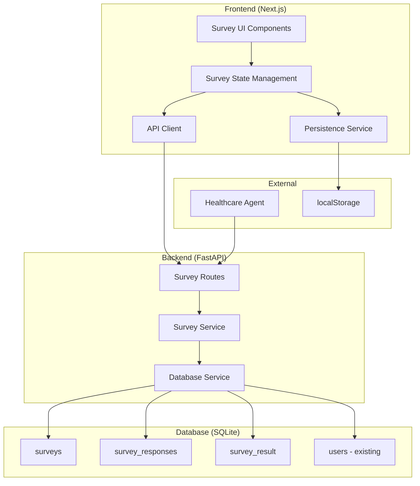

# Survey App - Design Document

## Overview

The Survey App is a full-stack web application designed to seamlessly integrate with the existing Healthcare Agent system. It provides a modern, responsive survey experience with real-time conditional branching, automatic progress saving, and comprehensive data persistence.

### Key Design Principles

1. **Integration First**: Reuse existing healthcare infrastructure (database service, configuration, logging)
2. **Progressive Enhancement**: Works offline with localStorage, syncs when online
3. **Accessibility**: WCAG 2.1 AA compliant with keyboard navigation and screen reader support
4. **Performance**: Optimized for mobile with lazy loading and efficient re-renders
5. **Maintainability**: Clear separation of concerns with testable, modular components

### Technology Stack

- **Backend**: FastAPI (Python 3.11+) with SQLModel/SQLAlchemy
- **Database**: SQLite (existing healthcare database)
- **Frontend**: Next.js 14 with App Router, TypeScript, Tailwind CSS
- **State Management**: React hooks with custom survey state management
- **Validation**: Zod for runtime validation, Pydantic for API validation
- **Testing**: Pytest (backend), Jest/Testing Library (frontend)

## Implementation Status

### ✅ Completed Components
- **SurveyService**: Complete survey management service with CRUD operations
- **Database Models**: All survey-related models implemented with proper relationships
- **Validation System**: Comprehensive validation for survey definitions and questions
- **Data Migration**: Personalization survey successfully loaded and validated
- **Testing**: Full test coverage with 21 unit tests
- **Survey Routes**: API endpoints for survey management and response handling
- **Auto-Save Implementation**: Frontend auto-save with navigation triggers and backend integration
- **Survey Completion Flow**: Complete submission with status updates and result creation
- **Frontend Integration**: React components with state management and backend synchronization

### 🔄 Remaining Components
- **Branching Logic**: Frontend conditional question flow (complex branching rules)
- **Advanced UI Features**: Loading skeletons, error boundaries, accessibility enhancements
- **Testing**: End-to-end testing and integration test coverage for new features


## Architecture

### System Architecture



### Data Flow

1. **Survey Loading**: Frontend fetches survey definition from `/api/survey/{code}`
2. **Response Management**: Backend looks up existing survey response with user_response JSON by `user_id` and `survey_code`
3. **State Restoration**: Frontend reconstructs answer state from user_response JSON field
4. **Auto-Save**: Complete survey state saved automatically with configurable delay (2s) or on navigation
5. **Progress Tracking**: Real-time progress calculation with each complete state save
6. **Branching Evaluation**: Frontend evaluates conditions locally for dynamic question flow
7. **Survey Completion**: Complete survey via `/api/survey-response` POST with status update and result creation


## Components and Interfaces

### Backend Components

#### 1. Survey Service (`healthcare/survey/survey_service.py`) ✅ **IMPLEMENTED**

Core business logic for survey management following the functional requirements API design.

**Implemented Features**:
- Complete CRUD operations for survey management
- Survey creation with UUID generation and duplicate prevention
- Survey retrieval by code and ID with proper error handling
- Survey listing with optional type filtering
- Comprehensive validation system for survey definitions
- Support for all question types: INPUT, SINGLE_SELECT, MULTIPLE_SELECT, DROPDOWN, TIME
- Branching rules validation with question reference checking
- File-based survey loading with proper error handling
- Full test coverage with 21 unit tests

#### 2. Survey Routes (`healthcare/survey/routes.py`)

API endpoints following the functional requirements:

**Survey Catalog & Schema:**
- `POST /api/survey` → Create catalog entry
- `GET /api/survey` → List surveys with `{id, code, title, type, active_version}`
- `GET /api/survey/{code}` → Full survey JSON definition

**Survey Response Management:**
- `GET /api/survey-response?user_id={external_id}&survey_code={code}` → Get existing response with `{ok, status, progress_pct, last_question_id, answers}`
- `POST /api/survey-response?user_id={external_id}&survey_code={code}` → Complete survey submission
- `POST /api/survey-response/answer?user_id={external_id}&survey_code={code}` → Save individual answer with `{question_id, value}`

**Agent Integration:**
- `POST /api/survey-links` → Generate signed survey URLs for agent

#### 3. Database Models (`healthcare/storage/models.py` - additions) ✅ **IMPLEMENTED**

Database schema following the functional requirements without survey sessions:

**Survey Definition:**
- `surveys` table: Stores survey definitions with code, title, version, type, definition_json ✅ **IMPLEMENTED**

**Survey Response Tracking:**
- `survey_responses` table: Tracks user survey responses with user_response JSON field ✅ **IMPLEMENTED** 
- `survey_results` table: Computed assessment outputs and derived metrics ✅ **IMPLEMENTED**
- `survey_answers` table: **REMOVED** - replaced by user_response JSON field for simplified storage

**Implementation Details**:
- All models implemented using SQLModel with proper type hints
- UUID-based primary keys for surveys and responses
- Proper foreign key relationships and constraints
- Unique constraints for survey codes and user-survey pairs
- Enum types for survey types and response status
- JSON storage for flexible survey definitions and answer values

**Database Schema Details:**
```sql
CREATE TABLE surveys (
  id TEXT PRIMARY KEY,
  code TEXT NOT NULL UNIQUE,
  title TEXT NOT NULL,
  version TEXT NOT NULL,
  type TEXT NOT NULL CHECK (type IN ('PERSONALIZATION','DISEASE_RISK','LIFE_STYLE')),
  description TEXT,
  definition_json TEXT NOT NULL,
  created_at DATETIME DEFAULT CURRENT_TIMESTAMP
);

CREATE TABLE survey_responses (
  id TEXT PRIMARY KEY,
  survey_id TEXT NOT NULL REFERENCES surveys(id),
  user_id INTEGER NOT NULL REFERENCES users(id),
  status TEXT NOT NULL CHECK (status IN ('in_progress','completed','cancelled')),
  progress_pct INTEGER NOT NULL DEFAULT 0,
  user_response TEXT,  -- JSON field: {"height_cm": "173", "smoke_status": "never"}
  created_at DATETIME DEFAULT CURRENT_TIMESTAMP,
  updated_at DATETIME DEFAULT CURRENT_TIMESTAMP
);

CREATE TABLE survey_results (
  id INTEGER PRIMARY KEY,
  response_id TEXT NOT NULL REFERENCES survey_responses(id),
  result_json TEXT NOT NULL,
  created_at DATETIME DEFAULT CURRENT_TIMESTAMP
);
```

**Indexes:**
- `survey_responses (user_id, survey_id)` for fast lookup
- `surveys (code, type)` for catalog queries
- `survey_results (response_id)` for efficient result retrieval

### Frontend Components

#### 1. Survey Container (`components/survey/survey-container.tsx`) ✅ **IMPLEMENTED**

**Existing component enhanced with:**
- Backend API integration for survey responses with completion flow
- Survey submission via `completeOnBackend()` with status update to 'completed'
- Automatic survey result creation with derived metrics on completion
- Error boundary implementation with graceful error handling
- Loading state management for submission and progress loading
- Progress persistence via localStorage and API with auto-sync

#### 2. Survey State Management (`hooks/use-survey.ts`) ✅ **IMPLEMENTED**

**Enhanced existing hook with:**
- Backend synchronization via survey-response APIs with auto-save functionality
- Auto-save on navigation (goToNext, goToPrevious, goToQuestion) with non-blocking saves
- Configurable auto-save delay (default 2 seconds) for answer persistence
- Survey completion integration with `completeOnBackend()` function
- Optimistic updates for better UX with error recovery and retry logic
- Progress persistence without sessions using real-time progress tracking

#### 3. Question Renderers (existing components)

**Enhanced existing components:**
- `QuestionInput`: Enhanced validation with backend sync
- `QuestionSingleSelect`: Optimized rendering with proper ARIA labels
- `QuestionMultipleSelect`: Enhanced exclusive option handling
- `QuestionDropdown`: Improved accessibility and search
- `QuestionTime`: New component for time-based inputs

#### 4. New Components

**Additional components needed:**
- Survey Error Boundary for graceful error handling
- Loading skeletons for better perceived performance
- Survey completion flow with results display
- Progress indicators and navigation controls


## Data Models

### Survey Definition Schema

```typescript
interface Survey {
  code: string                    // Unique survey identifier
  type: SurveyType               // PERSONALIZATION | DISEASE_RISK | LIFE_STYLE
  version: string                // Semantic version
  title: string                  // Display title
  description?: string           // Optional description
  questions: Question[]          // Flat array of questions (no sections)
  branching_rules: BranchingRule[] // Conditional logic rules
  metadata?: SurveyMetadata      // Additional metadata
}

interface Question {
  type: QuestionType             // INPUT | SINGLE_SELECT | MULTIPLE_SELECT | DROPDOWN | TIME
  code: string                   // Unique within survey
  title: string                  // Main question text
  subtitle?: string              // Optional helper text
  required?: boolean             // Validation requirement
  unit?: UnitType               // For INPUT questions
  unit_text?: string            // Display unit
  constraints?: Constraints     // Validation rules
  answers?: QuestionAnswers     // For select-type questions
  visible_if?: Condition        // Question-level visibility
  help?: string                 // Help text
}

interface BranchingRule {
  id: string                    // Unique rule identifier
  condition: Condition          // When to apply rule
  action: BranchingAction       // What to do
  priority?: number             // Rule evaluation order
}

interface Condition {
  operator: ConditionOperator   // equals | one_of | includes | gt | gte | lt | lte | and | or | not
  question_code: string         // Target question
  value: any                    // Comparison value
  conditions?: Condition[]      // For compound conditions
}

interface BranchingAction {
  type: ActionType              // skip_questions | goto_question | require_questions | show_questions
  target: string | string[]     // Target question(s)
  data?: Record<string, any>    // Additional action data
}
```

### API Request/Response Models

Following the functional requirements API specification:

**Survey Response Management:**
- `GET /api/survey-response` returns: `{ok, status, progress_pct, user_response: {"height_cm": "173", "smoke_status": "never"}}`
- `POST /api/survey-response` accepts: `{user_response: {...}, status?: "in_progress"|"completed"}` returns: `{ok, progress_pct}`
- Single endpoint handles both partial saves (in_progress) and final submission (completed)

**Survey Catalog:**
- `GET /api/survey` returns: `[{id, code, title, type, active_version}]`
- `GET /api/survey/{code}` returns: Full survey JSON definition

**Error Format:**
- All errors use: `{ok: false, error: {code, message, details}}`


## Auto-Save and Completion Implementation

### Auto-Save Strategy

**Frontend Auto-Save (`use-survey.ts`):**
- **Triggered Events**: Answer changes, navigation between questions, timeout-based saves
- **Save Timing**: Configurable delay (default 2 seconds) after answer input
- **Navigation Saves**: Non-blocking immediate saves of complete survey state when navigating
- **State Management**: Maintains complete answer state and saves entire user_response object
- **Error Handling**: Graceful degradation with local storage fallback and retry logic
- **Progress Tracking**: Real-time progress calculation with each successful state save

**Backend Response Save (`POST /api/survey-response`):**
- **Complete State Persistence**: Entire survey state saved in user_response JSON field
- **Progress Calculation**: Based on answered questions vs total visible questions from user_response
- **Response Status**: Handles both 'in_progress' and 'completed' status in single endpoint
- **Timestamps**: Updates response `updated_at` timestamp on each save
- **Flexible Storage**: JSON field allows for arbitrary question-answer mappings

### Survey Completion Flow

**Frontend Completion (`handleSubmit`):**
1. Call `completeOnBackend()` to finalize survey with status update
2. Invoke optional `onComplete` callback for additional processing
3. Clear local storage progress data
4. Navigate to completion screen with derived metrics display

**Backend Completion (`POST /api/survey-response` with status='completed'):**
1. Update survey response status to 'completed' with 100% progress
2. Calculate derived metrics (BMI, risk scores) from user_response JSON data
3. Create survey result record with computed metrics and assessments
4. Return completion result with metrics for frontend display

**Derived Metrics Calculation:**
- **Automatic Processing**: Backend calculates health metrics from user_response JSON data
- **Flexible Schema**: JSON storage allows for various metric types and future extensions  
- **Direct Access**: Metrics calculation reads directly from user_response field without joins
- **Error Resilience**: Completion succeeds even if metrics calculation fails


## Error Handling

### Backend Error Handling

**Backend Error Handling:**
- Consistent error format: `{ok: false, error: {code, message, details}}`
- Proper HTTP status codes for different error types
- Survey-specific exceptions for not found, invalid answers, etc.

### Frontend Error Handling

**Frontend Error Handling:**
- Error boundaries for graceful degradation
- Retry mechanisms for network failures
- User-friendly error messages
- Fallback states for various error scenarios


## Testing Strategy

### Backend Testing

**Backend Testing:**
- Unit tests for survey service business logic ✅ **IMPLEMENTED** (21 tests)
- API endpoint tests for all survey routes ⏳ **PENDING**
- Integration tests for complete survey workflows ⏳ **PENDING**
- Database operation tests ✅ **IMPLEMENTED** (included in service tests)
- Error handling and validation tests ✅ **IMPLEMENTED** (comprehensive coverage)

**Implemented Test Coverage**:
- Survey creation and validation tests
- CRUD operations testing
- File loading and error handling tests
- Comprehensive validation tests for all question types
- Branching rules validation tests
- Database integration tests with temporary databases

### Frontend Testing

**Frontend Testing:**
- Component tests for all survey UI components
- Hook tests for survey state management
- Integration tests for complete user workflows
- E2E tests for critical user journeys
- Accessibility and responsive design tests
